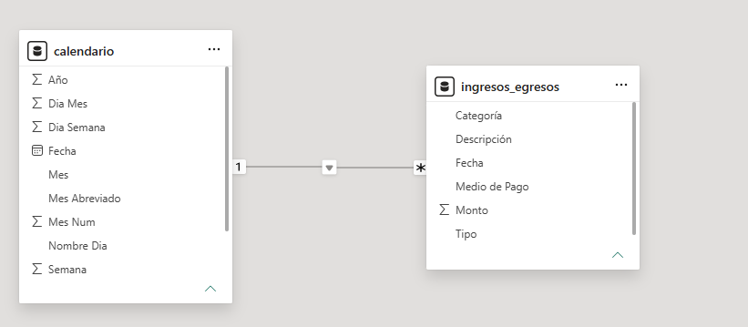

# 09 - Panel de Control de Ingresos y Egresos (Asistido por IA)

## 📌 Descripción del Proyecto
Este proyecto consiste en un **Panel de Control Financiero** desarrollado en Power BI para el análisis integral del flujo de caja (Ingresos vs. Egresos) correspondiente al período **2025**. 

Su objetivo principal es ofrecer una visibilidad clara sobre la evolución mensual de saldos, la tasa de variación del flujo de caja, el rendimiento por tipo y medio de pago, y la **identificación de los egresos críticos** mediante una **Análisis de Pareto (Regla 80/20)**.

Para la construcción de las fórmulas DAX del gráfico de Pareto, se aplicó **Prompt Engineering asistido con Gemini AI**, optimizando la lógica de acumulación dinámica sobre la dimensión de descripciones.

---

## 📊 Vista Previa del Dashboard



---

## 🏗️ Modelo de Datos y Arquitectura
El modelo de datos adopta un esquema en estrella (*Star Schema*) simple y eficiente, conectando la tabla de hechos relacional con un modelo de tiempo estandarizado:

* **`ingresos_egresos`** (Tabla de Hechos): Registra cada transacción indicando la fecha, categoría (*Ingreso/Egreso*), tipo de flujo, descripción del movimiento, medio de pago y monto.
* **`calendario`** (Tabla de Dimensión): Tabla de tiempo conectada mediante una relación de `1 a muchos` (`1:*`) con filtrado unidireccional hacia la tabla de hechos.


---

## 🤖 Prompt Engineering & Integración con IA
Para desarrollar las medidas DAX complejas del análisis de Pareto (80/20) para las descripciones de egresos, se utilizó la siguiente solicitud estructurada en Gemini:

```text
"Tengo una base de datos que se llama ingresos_egresos me puedes crear un gráfico de pareto en power bi en base a la columna descripción. Me gustaría que me dieras las medidas dax necesarias (tengo una medida base que es la suma del monto total). También te envié los nombres de las columnas."


(El detalle del intercambio original se conserva en el archivo Prompt-Gráfico de Pareto.txt).

🧮 Medidas DAX Implementadas
Las medidas se encuentran organizadas en la tabla dedicada DAX-Medidas:

💵 Métricas Base y Saldos

Monto Total = SUM(ingresos_egresos[Monto])

Total Ingresos = CALCULATE([Monto Total], ingresos_egresos[Categoría] = "Ingreso")

Total Egresos = CALCULATE([Monto Total], ingresos_egresos[Categoría] = "Egreso")

Saldo Inicial = CALCULATE([Monto Total], ingresos_egresos[Descripción] = "Saldo Inicial en Caja")

Saldo Final = [Total Ingresos] - [Total Egresos]

Diferencia de Saldos = [Saldo Final] - [Saldo Inicial]

Saldo Acumulado = TOTALYTD([Saldo Final], calendario[Fecha])

Var. Saldo = DIVIDE([Saldo Final], [Saldo Inicial], 0) - 1

Variacion de Saldo por Mes = 
VAR saldomesanterior = CALCULATE([Saldo Final], PREVIOUSMONTH(calendario[Fecha]))
RETURN
DIVIDE([Saldo Final], saldomesanterior, 0) - 1

📈 Tasas de Crecimiento y Textos Dinámicos

Tasa de Crecimiento Mensual (Ingresos) = 
VAR IngresosMesAnterior = CALCULATE([Total Ingresos], DATEADD(calendario[Fecha], -1, MONTH))
RETURN
DIVIDE([Total Ingresos], IngresosMesAnterior, 0) - 1

Tasa de Crecimiento Mensual (Egresos) = 
VAR EgresosMesAnterior = CALCULATE([Total Egresos], DATEADD(calendario[Fecha], -1, MONTH))
RETURN
DIVIDE([Total Egresos], EgresosMesAnterior, 0) - 1

Textos Dinamicos (Ingresos) = 
IF([Tasa de Crecimiento Mensual (Ingresos)] > 0, "Aumentaron", 
    IF([Tasa de Crecimiento Mensual (Ingresos)] < 0, "Disminuyeron", "Se Mantuvieron Estable")
)

Textos Dinamicos (Egresos) = 
IF([Tasa de Crecimiento Mensual (Egresos)] > 0, "Aumentaron", 
    IF([Tasa de Crecimiento Mensual (Egresos)] < 0, "Disminuyeron", "Se Mantuvieron Estable")
)

Icono = IF([Saldo Final] >= 1, "✅", IF([Saldo Final] <= -1, "❌", "⚠️"))

📊 Lógica del Gráfico de Pareto (Generada con IA)

Monto Acumulado Pareto = 
VAR MontoActual = [Monto Total]
RETURN
SUMX(
    FILTER(
        ALLSELECTED(ingresos_egresos[Descripción]),
        [Monto Total] >= MontoActual
    ),
    [Monto Total]
)

% Acumulado Pareto = 
DIVIDE(
    [Monto Acumulado Pareto],
    CALCULATE([Monto Total], ALLSELECTED(ingresos_egresos[Descripción]))
)


🛠️ Herramientas Utilizadas
Power BI Desktop: Transformación de datos (Power Query), modelado dimensional y diseño visual.

DAX (Data Analysis Expressions): Cálculos de inteligencia de tiempo (Time Intelligence), variaciones dinámicas y análisis de Pareto.

Google Gemini AI: Asistencia en lógica DAX para la curva acumulada de Pareto.

Excel / CSV: Fuente de datos estandarizada para el período 2025.

🔗 Referencias
Proyecto inspirado en el diseño interactivo de https://www.youtube.com/watch?v=EbychT6uHHE

Personalizaciones introducidas: Actualización de datos al año 2025, inclusión de KPI con indicadores condicionales visuales (Icono), narrativas dinámicas basadas en tasas de crecimiento mensual y optimización DAX para Pareto asistido por IA.
