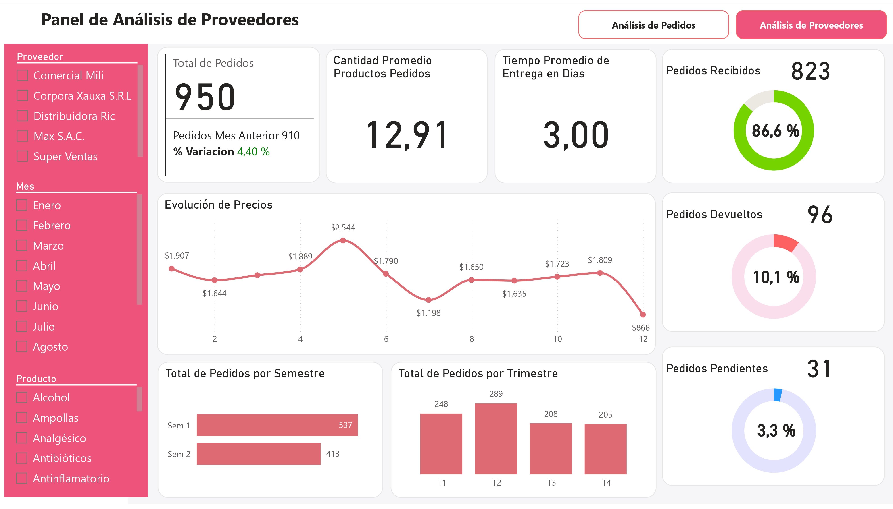
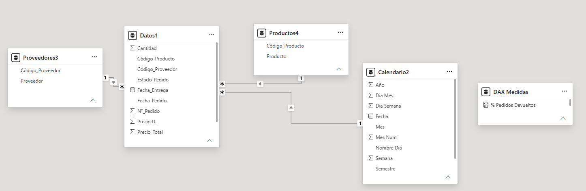

# 11. Análisis de Pedidos y Proveedores

Dashboard interactivo de doble panel para el monitoreo integral del ciclo de compras: desde la solicitud de productos hasta la evaluación del desempeño de proveedores. Diseñado para identificar cuellos de botella en entregas, optimizar el inventario y fortalecer la relación comercial con los proveedores clave.

---

## 📊 Vista Previa

| Panel de Análisis de Pedidos | Panel de Análisis de Proveedores |
|:---:|:---:|
|  |  |

---

## 🎯 Objetivos del Proyecto

- **Control Operativo:** Supervisar el estado de los pedidos (recibidos, pendientes, devueltos) en tiempo real.
- **Gestión de Inventario:** Identificar los productos más y menos demandados para ajustar niveles de stock.
- **Evaluación de Proveedores:** Medir tiempos de entrega, cumplimiento de pedidos y evolución de precios por proveedor.
- **Planificación Temporal:** Analizar tendencias de compra por mes, trimestre y semestre para la toma de decisiones estratégicas.

---

## 🗂️ Estructura del Proyecto

```
11_Analisis_Pedidos_Proveedores/
├── captures/
│   ├── 01.dashboard-pedidos.jpg      # Panel principal de pedidos
│   ├── 02.dashboard-proveedores.jpg  # Panel de evaluación de proveedores
│   ├── 03.modelado-datos.png         # Diagrama del modelo de datos
│   ├── 04.datos.png                  # Vista previa de la tabla de hechos
│   ├── 05.productos.png              # Catálogo de productos
│   └── 06.proveedores.png            # Catálogo de proveedores
├── data/
│   └── data.xlsx                     # Dataset fuente
├── dashboard-analisis-pedidos-proveedores.pbix
└── README.md
```

---

## 🛠️ Modelado de Datos

Se implementó un **Esquema de Estrella (Star Schema)** para garantizar rendimiento óptimo y flexibilidad en los análisis:

| Tabla | Tipo | Descripción |
|---|---|---|
| `Datos1` | **Hechos** | Registros de pedidos con cantidad, precio, estado, fechas y tiempos de entrega. |
| `Proveedores3` | Dimensión | Catálogo de 5 proveedores (`P0001` - `P0005`). |
| `Productos4` | Dimensión | Catálogo de 20 productos médicos y de cuidado personal. |
| `Calendario2` | Dimensión | Tabla de fechas inteligente para análisis temporal (día, mes, trimestre, semestre). |
| `DAX Medidas` | Medidas | Cálculos centralizados de KPIs y métricas de desempeño. |



---

## 📈 Paneles y KPIs Principales

### Panel 1: Análisis de Pedidos
| Métrica | Valor | Descripción |
|---|---|---|
| Cant. Prod. Pedidos | **12.260** | Unidades totales solicitadas ($266.675) |
| Productos Recibidos | **10.745** | Unidades entregadas correctamente ($234.039) |
| Productos Pendientes | **428** | Unidades en tránsito ($9.430) |
| Productos Devueltos | **1.087** | Unidades rechazadas ($23.206) |

**Visualizaciones destacadas:**
- **Evolución mensual:** Tendencia de pedidos con pico en mayo (1.597 unidades).
- **Top 5 productos más pedidos:** Antibióticos, Antinflamatorio, Gel, Hipoclorito sódico, Humectantes.
- **Top 5 productos menos pedidos:** Ampollas, Clorhexidina, Desodorantes, Termómetros, Ungüento.
- **Distribución semestral:** 57,18% de los pedidos concentrados en el segundo semestre.

### Panel 2: Análisis de Proveedores
| Métrica | Valor | Descripción |
|---|---|---|
| Total de Pedidos | **950** | Pedidos procesados (Variación: +4,40% vs mes anterior) |
| Cant. Promedio por Pedido | **12,91** | Unidades promedio por orden de compra |
| Tiempo Promedio de Entrega | **3,00 días** | Lead time operativo |
| Pedidos Recibidos | **823** | Tasa de cumplimiento: **86,6%** |
| Pedidos Devueltos | **96** | Tasa de devolución: **10,1%** |
| Pedidos Pendientes | **31** | Tasa de pedidos en tránsito: **3,3%** |

**Visualizaciones destacadas:**
- **Evolución de precios:** Monitoreo del costo promedio mensual (rango: $868 - $2.544).
- **Desempeño por semestre y trimestre:** Comparativa de volumen de pedidos (T1: 248, T2: 289, T3: 208, T4: 205).
- **Filtros dinámicos:** Segmentación por proveedor, mes y producto para análisis granular.

---

## 🧮 Medidas DAX

### Métricas Base

| Medida | Fórmula DAX | Descripción |
|---|---|---|
| **Total de Pedidos** | `COUNTROWS(Datos1)` | Conteo total de órdenes de compra. |
| **Cant. de Productos Pedidos** | `SUM(Datos1[Cantidad])` | Suma total de unidades solicitadas. |
| **$ Precio Total** | `SUM(Datos1[Precio_Total])` | Suma total del valor monetario de los pedidos. |
| **Cantidad Promedio Productos Pedidos** | `AVERAGE(Datos1[Cantidad])` | Promedio de unidades por línea de pedido. |
| **Tiempo Promedio Entrega Días** | `CALCULATE(AVERAGE(Datos1[Tiempo_Entrega(Días)]), Datos1[Estado_Pedido]="Recibido")` | Lead time promedio solo para pedidos efectivamente entregados. |

### Métricas por Estado de Pedido

| Medida | Fórmula DAX | Descripción |
|---|---|---|
| **Pedidos Recibidos** | `CALCULATE([Total de Pedidos], Datos1[Estado_Pedido]="Recibido")` | Conteo de pedidos entregados. |
| **Pedidos Pendientes** | `CALCULATE([Total de Pedidos], Datos1[Estado_Pedido]="Pendiente")` | Conteo de pedidos en tránsito. |
| **Pedidos Devueltos** | `CALCULATE([Total de Pedidos], Datos1[Estado_Pedido]="Devuelto")` | Conteo de pedidos rechazados. |
| **Productos Recibidos** | `CALCULATE([Cant. de Productos Pedidos], Datos1[Estado_Pedido]="Recibido")` | Unidades entregadas. |
| **Productos Pendientes** | `CALCULATE([Cant. de Productos Pedidos], Datos1[Estado_Pedido]="Pendiente")` | Unidades en tránsito. |
| **Productos Devueltos** | `CALCULATE([Cant. de Productos Pedidos], Datos1[Estado_Pedido]="Devuelto")` | Unidades rechazadas. |
| **$ Productos Recibidos** | `CALCULATE([$ Precio Total], Datos1[Estado_Pedido]="Recibido")` | Valor monetario de entregas. |
| **$ Productos Pendientes** | `CALCULATE([$ Precio Total], Datos1[Estado_Pedido]="Pendiente")` | Valor monetario en tránsito. |
| **$ Productos Devueltos** | `CALCULATE([$ Precio Total], Datos1[Estado_Pedido]="Devuelto")` | Valor monetario de devoluciones. |

### Porcentajes de Cumplimiento

| Medida | Fórmula DAX | Descripción |
|---|---|---|
| **% Pedidos Recibidos** | `DIVIDE([Pedidos Recibidos], [Total de Pedidos], 0)` | Tasa de cumplimiento del proveedor. |
| **% Pedidos Pendientes** | `DIVIDE([Pedidos Pendientes], [Total de Pedidos], 0)` | Tasa de pedidos en tránsito. |
| **% Pedidos Devueltos** | `DIVIDE([Pedidos Devueltos], [Total de Pedidos], 0)` | Tasa de devoluciones / rechazos. |

### Análisis Temporal

| Medida | Fórmula DAX | Descripción |
|---|---|---|
| **Pedidos Mes Anterior** | `CALCULATE([Total de Pedidos], DATEADD(Calendario2[Fecha], -1, MONTH))` | Volumen de pedidos del mes previo para comparativa. |
| **% Variacion** | `([Total de Pedidos] / [Pedidos Mes Anterior]) - 1` | Crecimiento o decrecimiento mensual en porcentaje. |

### Medidas para Gráficos de Anillo (Donut)

| Medida | Fórmula DAX | Descripción |
|---|---|---|
| **Grafico Recibidos** | `[Total de Pedidos] - [Pedidos Recibidos]` | Segmento complementario para visualización del gráfico de dona (pedidos NO recibidos). |
| **Grafico Pendientes** | `[Total de Pedidos] - [Pedidos Pendientes]` | Segmento complementario para visualización del gráfico de dona. |
| **Grafico Devueltos** | `[Total de Pedidos] - [Pedidos Devueltos]` | Segmento complementario para visualización del gráfico de dona. |

> **Nota técnica:** Las medidas `Grafico *` se utilizan para construir los gráficos de anillo (donut) mostrando el contraste entre el estado objetivo y su complemento, logrando el efecto visual de "progreso circular".

---

## 🧩 Filtros y Segmentaciones

| Filtro | Aplicación | Panel |
|---|---|---|
| **Estado Pedido** | Devuelto, Pendiente, Recibido | Pedidos |
| **Nombre Día** | lunes a domingo | Pedidos |
| **Mes** | Enero a Diciembre | Ambos |
| **Proveedor** | Comercial Mili, Corpora Xauxa S.R.L, Distribuidora Ric, Max S.A.C., Super Ventas | Proveedores |
| **Producto** | Alcohol, Ampollas, Analgésico, Antibióticos, Antinflamatorio, etc. | Proveedores |

---

## 💡 Insights Clave

1. **Estacionalidad de demanda:** El segundo semestre concentra el 57% de los pedidos, sugiriendo una campaña de compras de fin de año o necesidades estacionales.
2. **Productos críticos:** Los Antibióticos lideran en valor total ($23.529), mientras que los menos pedidos representan oportunidades de ajuste de stock.
3. **Eficiencia de proveedores:** Un lead time promedio de 3 días es competitivo, aunque el 10,1% de devoluciones indica oportunidad de mejora en control de calidad.
4. **Variación de precios:** El precio promedio mensual muestra alta volatilidad (máx: $2.544 en mayo vs mín: $868 en diciembre), relevante para negociación de contratos.

---

## 🏗️ Tecnologías y Habilidades Aplicadas

- **Power BI Desktop:** Visualizaciones interactivas con navegación entre paneles.
- **DAX:** Medidas calculadas con `CALCULATE`, `DIVIDE`, `DATEADD`, `AVERAGE` y variables implícitas para análisis de cumplimiento, inteligencia de tiempo y segmentación condicional.
- **Power Query / ETL:** Limpieza y transformación del dataset fuente en Excel.
- **Modelado Dimensional:** Esquema de estrella con tablas de dimensiones normalizadas.
- **UX/UI:** Diseño con paleta corporativa (rosa/magenta), iconografía intuitiva y jerarquía visual clara.

---

## 🚀 Cómo Usar

1. Clona el repositorio:
   ```bash
   git clone https://github.com/darwinjcn/powerbi-proyectos.git
   ```
2. Navega a la carpeta del proyecto:
   ```bash
   cd powerbi-proyectos/11_Analisis_Pedidos_Proveedores
   ```
3. Abre el archivo `dashboard-analisis-pedidos-proveedores.pbix` en **Power BI Desktop**.
4. Explora los paneles utilizando los filtros del panel izquierdo y los botones de navegación superior.

---

## 📬 Contacto

¿Te interesa este proyecto o quieres conversar sobre Business Intelligence?

- **LinkedIn:** [Darwin Colmenares](https://www.linkedin.com/in/darwin-colmenares-8a5639247/)
- **Email:** colmenaresdarwin06@gmail.com
- **Portafolio:** [github.com/darwinjcn/powerbi-proyectos](https://github.com/darwinjcn/powerbi-proyectos)

---

<p align="center">
  <i>Transformando datos complejos en decisiones estratégicas.</i>
</p>