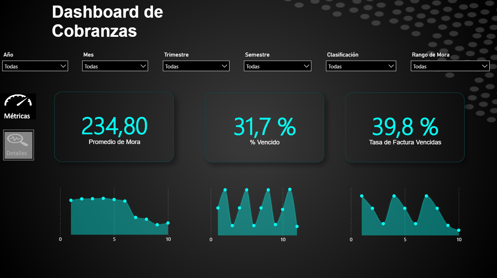
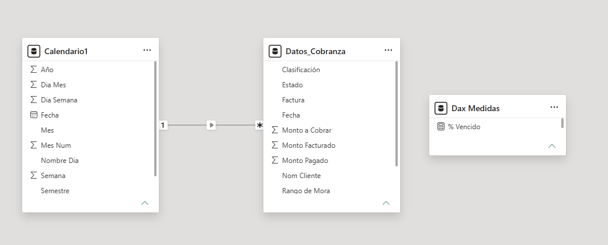

# 12. Panel de Cobranza 2024

Dashboard interactivo de doble panel para el control y seguimiento de cobranzas, diseñado para monitorear la cartera de clientes, analizar la antigüedad de mora y evaluar el estado de facturación. Permite identificar facturas vencidas, calcular tiempos promedio de mora y tomar decisiones estratégicas para la recuperación de cartera.

---

## 📊 Vista Previa

| Panel de Detalles | Panel de Métricas |
|:---:|:---:|
|  |  |

---

## 🎯 Objetivos del Proyecto

- **Control de Cartera:** Monitorear montos facturados, pagados y pendientes por cobrar en tiempo real.
- **Análisis de Mora:** Evaluar la antigüedad de deudas y clasificarlas por rangos para priorizar acciones de cobro.
- **Seguimiento de Facturas:** Identificar facturas pagadas, vencidas y vigentes con indicadores visuales claros.
- **Toma de Decisiones:** Proporcionar métricas clave como promedio de mora, porcentaje vencido y tasa de facturas vencidas.

---

## 🗂️ Estructura del Proyecto

```
12_Panel_Cobranza/
├── data/
│   └── data.xlsx                               # Dataset fuente
├── imagenes/
│   ├── 01.detalles-cobranza.png                # Panel de detalles de cobranza
│   ├── 02.metricas-cobranzas.png                 # Panel de métricas principales
│   └── 04.modelado-estrella-datos.png            # Diagrama del modelo de datos
├── Panel de Cobranza 2024-Proyecto Darwin-Colmenares.pbix
└── README.md
```

---

## 🛠️ Modelado de Datos

Se implementó un **Esquema de Estrella (Star Schema)** optimizado para análisis de cobranzas:

| Tabla | Tipo | Descripción |
|---|---|---|
| `Datos_Cobranza` | **Hechos** | Registros de facturas con montos, estados, clasificación, días vencidos y rango de mora. |
| `Calendario1` | Dimensión | Tabla de fechas inteligente para análisis temporal (año, mes, trimestre, semestre, día). |
| `Dax Medidas` | Medidas | Cálculos centralizados de KPIs financieros y operativos. |



**Relación:** `Calendario1[Fecha]` (1) → (*) `Datos_Cobranza[Fecha]`

---

## 📈 Paneles y KPIs Principales

### Panel 1: Detalles
| Métrica | Valor | Descripción |
|---|---|---|
| Monto a Cobrar | **1.291.880** | Saldo pendiente de cobro por facturas vigentes y vencidas. |
| Monto Facturado | **4.072.800** | Total facturado en el periodo. |
| Monto Pagado | **2.780.920** | Total recaudado (215,3% del monto a cobrar). |

**Visualizaciones destacadas:**
- **Antigüedad de Mora:** Distribución de facturas vencidas por rangos:
  - Más de 180 días: 77 facturas
  - Menos de 180 días: 38 facturas
  - Menos de 60 días: 6 facturas
  - Menos de 90 días: 5 facturas
  - Menos de 30 días: 2 facturas
- **Embudo de Facturación:** Visualización del flujo Monto Facturado → Monto Pagado → Monto a Cobrar.
- **Estado de Facturas:** Gráfico de dona con distribución:
  - Pagada: 159 facturas (49,38%)
  - Vencida: 128 facturas (39,75%)
  - Vigente: 35 facturas (10,87%)
- **Tabla Detalle:** Listado de facturas con cliente, montos, días vencidos y estado con iconos indicadores.

### Panel 2: Métricas
| Métrica | Valor | Descripción |
|---|---|---|
| Promedio de Mora | **234,80 días** | Tiempo promedio de retraso en facturas vencidas. |
| % Vencido | **31,7%** | Proporción del monto facturado que está pendiente de cobro. |
| Tasa de Factura Vencidas | **39,8%** | Porcentaje de facturas que han superado su fecha de pago. |

**Visualizaciones destacadas:**
- **Gráficos de área:** Tendencias de métricas clave a lo largo del tiempo.
- **Navegación lateral:** Botones interactivos para alternar entre paneles (Métricas / Detalles).

---

## 🧮 Medidas DAX

### Métricas Base

| Medida | Fórmula DAX | Descripción |
|---|---|---|
| **Total Facturas** | `COUNT(Datos_Cobranza[Factura])` | Conteo total de facturas registradas. |
| **Suma Monto Facturado** | `SUM(Datos_Cobranza[Monto Facturado])` | Valor total facturado en el periodo analizado. |
| **Suma Monto Pagado** | `SUM(Datos_Cobranza[Monto Pagado])` | Valor total recaudado de clientes. |
| **Suma Monto a Cobrar** | `SUM(Datos_Cobranza[Monto a Cobrar])` | Saldo pendiente de cobro (diferencia entre facturado y pagado). |
| **Cantidad Rango Mora** | `COUNTA(Datos_Cobranza[Rango de Mora])` | Conteo de registros con clasificación de mora. |

### Métricas de Mora y Vencimiento

| Medida | Fórmula DAX | Descripción |
|---|---|---|
| **Facturas Vencidas** | `CALCULATE([Total Facturas], Datos_Cobranza[Estado]="Vencida")` | Conteo de facturas con estado "Vencida". |
| **Promedio de Mora** | `CALCULATE(AVERAGE(Datos_Cobranza[Vencido (DÍAS)]), Datos_Cobranza[Estado]="Vencida")` | Promedio de días de retraso solo para facturas vencidas. |
| **% Vencido** | `DIVIDE([Suma Monto a Cobrar], [Suma Monto Facturado], 0)` | Porcentaje del monto facturado que aún no ha sido cobrado. |
| **Tasa de Factura Vencidas** | `DIVIDE([Facturas Vencidas], [Total Facturas], 0)` | Proporción de facturas vencidas sobre el total de facturas emitidas. |

---

## 🧩 Filtros y Segmentaciones

| Filtro | Aplicación | Panel |
|---|---|---|
| **Año** | 2024 (y otros disponibles) | Ambos |
| **Mes** | Enero a Diciembre | Ambos |
| **Trimestre** | T1, T2, T3, T4 | Ambos |
| **Semestre** | Sem 1, Sem 2 | Ambos |
| **Clasificación** | Categorías de cliente | Ambos |
| **Rango de Mora** | Menos de 30 días, Menos de 60 días, Menos de 90 días, Menos de 180 días, Más de 180 días | Detalles |
| **Nombre Cliente** | Filtro por cliente específico | Detalles |

---

## 💡 Insights Clave

1. **Alta concentración de mora prolongada:** El 77% de las facturas vencidas tienen más de 180 días de retraso, indicando una cartera altamente deteriorada que requiere acciones de cobro agresivas o provisión.
2. **Recuperación parcial:** Aunque se ha pagado el 68,3% del monto facturado, el 31,7% pendiente representa un riesgo significativo de liquidez.
3. **Tasa de vencimiento crítica:** Casi 4 de cada 10 facturas (39,8%) están vencidas, lo que sugiere problemas en las políticas de crédito o en los procesos de cobranza.
4. **Promedio de mora elevado:** Con 234,80 días de mora promedio, las facturas vencidas tienen casi 8 meses de retraso, superando ampliamente los estándares de la industria (generalmente 30-90 días).
5. **Facturas vigentes bajo control:** Solo el 10,87% de las facturas están vigentes, lo que indica que la mayoría del flujo ya ha sido clasificado como pagado o vencido.

---

## 🏗️ Tecnologías y Habilidades Aplicadas

- **Power BI Desktop:** Visualizaciones interactivas con navegación entre paneles mediante botones personalizados.
- **DAX:** Medidas calculadas con `CALCULATE`, `DIVIDE`, `AVERAGE`, `COUNT`, `COUNTA` y `SUM` para análisis financiero y de morosidad.
- **Power Query / ETL:** Limpieza y transformación del dataset fuente en Excel.
- **Modelado Dimensional:** Esquema de estrella con tabla de hechos y dimensión de calendario.
- **UX/UI:** Diseño dark mode con paleta cian/negro, iconografía intuitiva (check para pagadas, alerta para vigentes) y jerarquía visual clara.

---

## 🚀 Cómo Usar

1. Clona el repositorio:
   ```bash
   git clone https://github.com/darwinjcn/powerbi-proyectos.git
   ```
2. Navega a la carpeta del proyecto:
   ```bash
   cd powerbi-proyectos/12_Panel_Cobranza
   ```
3. Abre el archivo `Panel de Cobranza 2024-Proyecto Darwin-Colmenares.pbix` en **Power BI Desktop**.
4. Explora los paneles utilizando los filtros superiores y los botones de navegación lateral (Métricas / Detalles).

---

## 📬 Contacto

¿Te interesa este proyecto o quieres conversar sobre Business Intelligence?

- **LinkedIn:** [Darwin Colmenares](https://www.linkedin.com/in/darwin-colmenares-8a5639247/)
- **Email:** colmenaresdarwin06@gmail.com
- **Portafolio:** [github.com/darwinjcn/powerbi-proyectos](https://github.com/darwinjcn/powerbi-proyectos)

---

<p align="center">
  <i>Transformando datos complejos en decisiones estratégicas.</i>
</p>