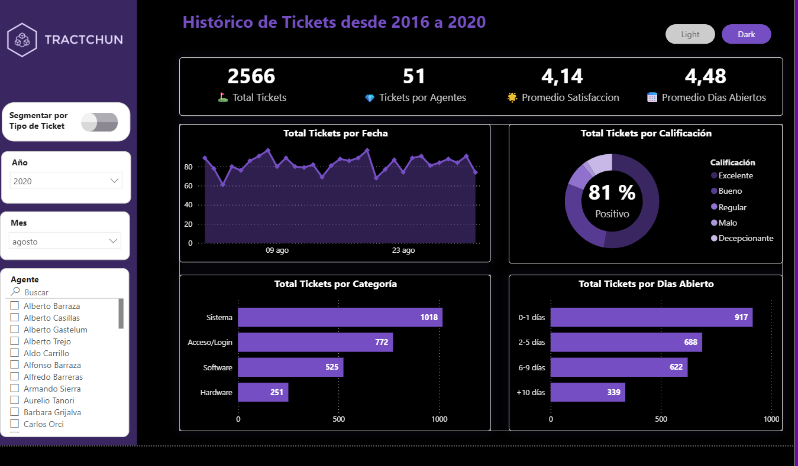
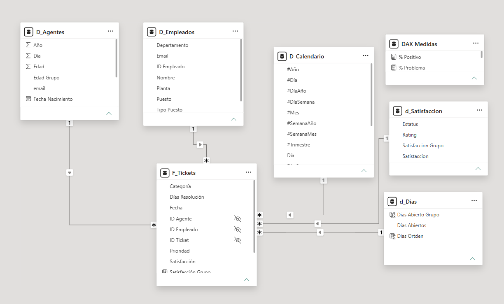

# 🎧 13. Reporte de Tickets e Incidencias de Tecnología (Tractchun) | Power BI


## 📌 Descripción General

Este proyecto de Business Intelligence ofrece un análisis exhaustivo del rendimiento del departamento de Soporte de TI y atención de solicitudes de la empresa **Tractchun** durante el periodo **2016-2020**. 

Permite evaluar la eficiencia operativa en la resolución de incidencias, la carga de trabajo por agente de soporte, el nivel de satisfacción de los usuarios finales y los tiempos promedio de respuesta según la categoría y prioridad del ticket.

### Características Clave:
* **Soporte Tema Claro / Oscuro (Light / Dark Mode):** Interfaz adaptativa e interactiva para mejorar la visualización según el entorno del usuario.
* **Sistema de Ranking Dinámico de Agentes:** Evaluación ponderada de agentes basada en volumen de tickets atendidos, satisfacción promedio obtenida y velocidad de resolución.
* **Análisis de Tipos e Incidencias:** Desglose entre *Problemas* y *Solicitudes* clasificados por categorías (*Sistema*, *Acceso/Login*, *Software*, *Hardware*) y rangos de días abiertos.

---

## 📸 Vista Previa del Dashboard

### 1. Tema Claro (Light Mode)


### 2. Tema Oscuro (Dark Mode)


---

## 🏗️ Arquitectura del Modelo de Datos

El proyecto implementa un modelo multidimensional en estrella (*Star Schema*) optimizado para garantizar la integridad analítica y un rendimiento eficiente en DAX.



### Tablas del Modelo:
* **`F_Tickets` (Tabla de Hechos):** Registra cada transacción e incidencia (`ID Ticket`, `Fecha`, `ID Agente`, `ID Empleado`, `Categoría`, `Prioridad`, `Días Resolución`, `Satisfacción`).
* **`D_Agentes` (Dimensión):** Información de los agentes de soporte de TI.
* **`D_Empleados` (Dimensión):** Datos de los usuarios/empleados que generan los tickets (`Puesto`, `Departamento`, `Planta`).
* **`D_Calendario` (Dimensión de Tiempo):** Tabla temporal completa para análisis evolutivo y time intelligence (`#Año`, `#Mes`, `#Trimestre`, `#SemanaAño`, `#Día`, `Día Laboral`).
* **`d_Satisfaccion` (Dimensión):** Clasificación del nivel de respuesta (`Estatus`, `Rating`, `Satisfacción Grupo`).
* **`d_Dias` (Dimensión):** Agrupación por rangos de días transcurridos (`Días Abiertos`, `Días Abierto Grupo`).
* **`DAX Medidas`:** Tabla contenedora de la lógica de negocio y cálculo de KPIS.

---

## 📐 Lógica de Negocio y Medidas DAX

### 📈 Métricas de Volumen y Eficiencia
```dax
// Conteo total de tickets con validación de valores en blanco
Total Tickets = IF( ISBLANK( COUNTROWS(F_Tickets) ) , 0 , COUNTROWS(F_Tickets) )

Total Tickets NOBLANK = COUNTROWS(F_Tickets)

// Conteo total ignorando filtros aplicados
Total Tickets ALL = CALCULATE( [Total Tickets] , ALL(F_Tickets) )

// Conteo ajustado a selecciones externas
Total Tickets ALLSELECTED = CALCULATE( [Total Tickets] , ALLSELECTED(F_Tickets) )

// Clasificación por tipo de ticket y evaluación
Total Tickets Positivos = CALCULATE( [Total Tickets] , d_Satisfaccion[Estatus] = "Positivo" )

Total Tickets Problemas = CALCULATE( [Total Tickets] , F_Tickets[Tipo] = "Problema" )
```

### ⏱️ Tiempos de Resolución y Satisfacción
```dax
// Promedio de días para resolver un ticket
Promedio Dias Abiertos = AVERAGE(F_Tickets[Días Resolución] )

// Nivel medio de satisfacción del usuario (1 a 5)
Promedio Satisfaccion = AVERAGE(F_Tickets[Satisfacción] )

// Distribución porcentual
% Positivo = DIVIDE( [Total Tickets Positivos] , [Total Tickets] , 0 )

% Problema = DIVIDE( [Total Tickets Problemas] , [Total Tickets] , 0 )
```

### 👨‍💻 Análisis y Desempeño por Agente
```dax
// Total de agentes registrados
Total Agentes = COUNTROWS(D_Agentes)

// Promedio estimado de tickets atendidos por agente
Tickets por Agentes = ROUND( DIVIDE( [Total Tickets] , [Total Agentes] , 0 ) , 0 )

Tickets por Agente ALLSELECTED = CALCULATE( [Tickets por Agentes] , ALLSELECTED(F_Tickets) )

// Variación respecto al promedio general de la selección
Tickets por Agente Variacion = [Total Tickets] - [Tickets por Agente ALLSELECTED]

// Segmentación según desempeño medio
Tickets por Agente Var Grupo = IF( [Tickets por Agente Variacion] >= 0 , "Arriba del Promedio" , "Debajo del Promedio")
```

### 🏆 Sistema de Ranking Ponderado de Agentes
```dax
Rank Tickets = RANKX( ALL(D_Agentes) , [Total Tickets] )

Rank Tickets ALLS = RANKX( ALLSELECTED(D_Agentes) , [Total Tickets] )

Rank Satisfaccion = RANKX( ALL(D_Agentes) , [Promedio Satisfaccion] )

Rank Dias = RANKX( ALL(D_Agentes) , [Promedio Dias Abiertos] , , ASC )

// Score total consolidado
Rank Total = [Rank Tickets] + [Rank Satisfaccion] + [Rank Dias]

// Ranking final global de desempeño
Rank Final = RANKX( ALL(D_Agentes) , [Rank Total] , , ASC )
```

---

## 🛠️ Herramientas Utilizadas

* **Power BI Desktop:** Modelado multidimensional, diseño UX/UI multinivel (Light/Dark theme) y bookmarks de navegación.
* **DAX (Data Analysis Expressions):** Algoritmo de ranking de desempeño, segmentación dinámica y métricas de rendimiento.
* **Power Query / ETL:** Modelado y estandarización de catálogos y dimensiones de soporte.
* **Microsoft Excel:** Archivos fuente de datos (`Agentes.xlsx`, `Lista+Empleados.xlsx`, `Puestos.xlsx`, carpeta `Tickets`).

---

## 📁 Estructura del Proyecto

```text
13_Reportes_Tickets_Tecnologia/
├── captures/
│   ├── 01.dashboard-claro.png
│   ├── 02.dashboard-oscuro.png
│   ├── 03.modelado-extrella.png
│   └── 04.tabla-calendaario.png
├── data/
│   ├── Tickets/
│   ├── Agentes.xlsx
│   ├── Lista+Empleados.xlsx
│   └── Puestos.xlsx
├── reporte-tickets-tecnologia.pbix
└── README.md
```

## 🚀 Cómo Usar

1. Clona el repositorio:
   ```bash
   git clone https://github.com/darwinjcn/powerbi-proyectos.git
   ```
2. Navega a la carpeta del proyecto:
   ```bash
   cd powerbi-proyectos/13_Reportes_Tickets_Tecnologia
   ```
3. Abre el archivo `reporte-tickets-tecnologia.pbix` en **Power BI Desktop**.
4. Explora los paneles utilizando los filtros laterales, el toggle de segmentación por tipo de ticket y los botones de alternancia entre temas Light/Dark.

---

## 📬 Contacto

¿Te interesa este proyecto o quieres conversar sobre Business Intelligence?

- **LinkedIn:** [Darwin Colmenares](https://www.linkedin.com/in/darwin-colmenares-8a5639247/)
- **Email:** colmenaresdarwin06@gmail.com
- **Portafolio:** [github.com/darwinjcn/powerbi-proyectos](https://github.com/darwinjcn/powerbi-proyectos)

---

<p align="center">
  <i>Transformando datos complejos en decisiones estratégicas.</i>
</p>