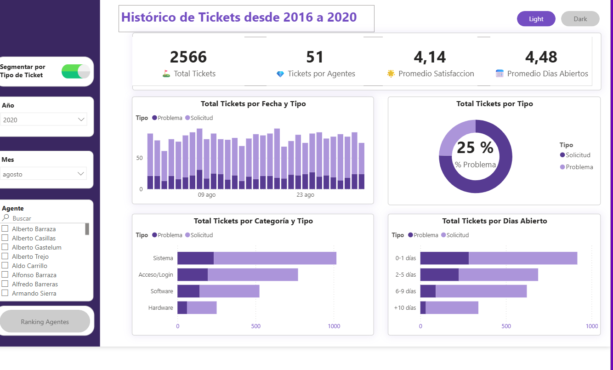
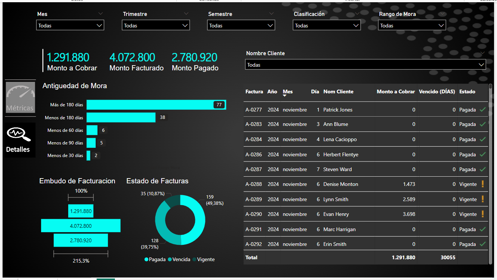
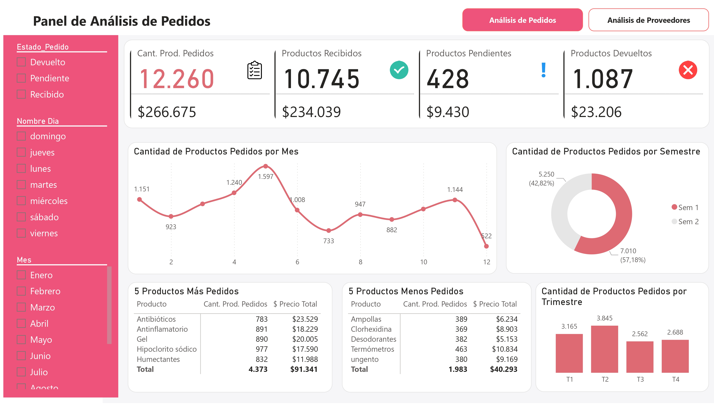
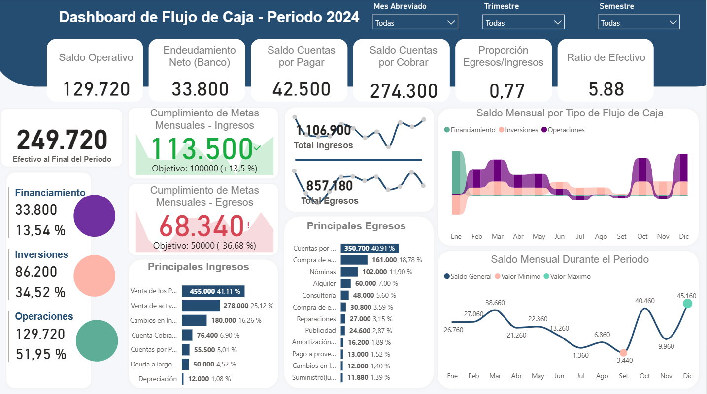
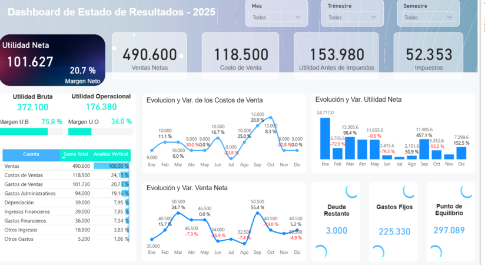
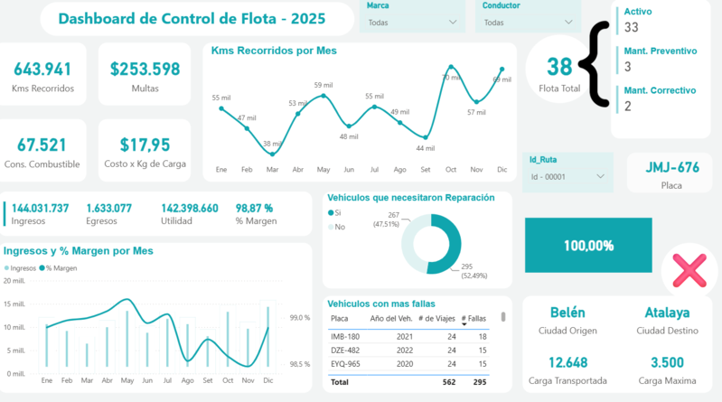
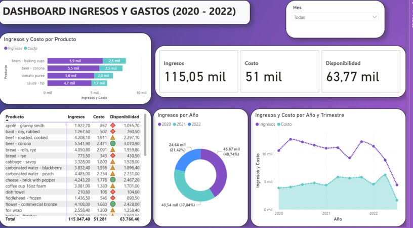
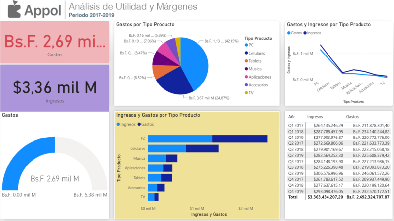

# 📊 Portafolio de Proyectos Power BI | Darwin Colmenares

**Business Intelligence | Data Analytics | Visualización de Datos**

---

## 🎯 **Sobre mí**
Soy **Darwin Colmenares**, especialista en Business Intelligence con experiencia en la creación de dashboards estratégicos que transforman datos en decisiones de negocio. Mi enfoque combina **DAX avanzado, modelado de datos y storytelling visual** para entregar soluciones de alto impacto.

---

## 🖼️ **Galería de Proyectos**

<!-- Proyecto 13 -->

  
  

    <h3>🎫 13. Reporte Tickets de Tecnología</h3>
    
Análisis operativo de soporte técnico (2016-2020) con ranking dinámico ponderado de agentes (volumen, satisfacción y tiempos de respuesta) y modos UI Claro/Oscuro.

    

      DAX Avanzado
      Ranking Dinámico
      UI Adaptativa
    

  

<!-- Proyecto 12 -->

  
  

    <h3>💰 12. Panel de Cobranza</h3>
    
Dashboard financiero de cuentas por cobrar, gestión de cartera, antigüedad de saldo (aging), índice de morosidad y tasa de recuperación de deuda.

    

      Finanzas
      Aging
      KPIs
    

  

<!-- Proyecto 11 -->

  
  

    <h3>📦 11. Análisis Pedidos Proveedores</h3>
    
Monitoreo y control de compras, gestión de pedidos a proveedores, análisis de volumen de abastecimiento y cumplimiento de entregas.

    

      Logística
      Compras
      Proveedores
    

  

<!-- Proyecto 10 -->

  
  

    <h3>💳 10. Flujo de Caja (Cash Flow)</h3>
    
Panel Financiero de Cash Flow (2024) para control de tesorería, liquidez operativa, saldos de cuentas por cobrar/pagar, endeudamiento neto.

    

      Tesorería
      Liquidez
      Cash Flow
    

  

<!-- Proyecto 09 -->

  
  

    <h3>🤖 09. Control Ingresos y Egresos (IA)</h3>
    
Dashboard de flujo de caja 2025 con Análisis de Pareto (80/20). Implementa IA (Gemini) para lógica DAX acumulada y narrativas dinámicas.

    

      IA
      Pareto
      Gemini
    

  

<!-- Proyecto 08 -->

  
  

    <h3>📈 08. Estado de Resultados (P&L)</h3>
    
Análisis financiero P&L con enfoque en margen neto (20.7%) y punto de equilibrio. Esquema de estrella y DAX avanzado.

    

      P&L
      Finanzas
      Margen Neto
    

  

<!-- Proyecto 07 -->

  
  

    <h3>🗺️ 07. Expansión Retail</h3>
    
Análisis geoespacial para toma de decisiones sobre nuevas aperturas comerciales utilizando herramientas de mapeo.

    

      Geoespacial
      Retail
      Mapeo
    

  

<!-- Proyecto 06 -->

  
  

    <h3>🚚 06. Gestión de Flota</h3>
    
Monitoreo operativo de activos logísticos, mantenimiento y KPIs de rendimiento de transporte.

    

      Logística
      Flota
      KPIs
    

  

<!-- Proyecto 05 -->

  
  

    <h3>💸 05. Control Ingresos/Gastos</h3>
    
Dashboard financiero para el control y análisis de ingresos y gastos.

    

      Finanzas
      Control
    

  

<!-- Proyecto 04 -->

  
  

    <h3>🌳 04. Reporte Jerárquico</h3>
    
Visualización de datos en estructura de árbol para análisis organizacional.

    

      Jerarquía
      Organización
    

  

<!-- Proyecto 03 -->

  
  

    <h3>📚 03. Fundamentos Power BI</h3>
    
Curso básico de Power BI con ejemplos prácticos y mejores prácticas.

    

      Educación
      Fundamentos
    

  

<!-- Proyecto 02 -->

  
  

    <h3>🎨 02. Dashboarding Avanzado</h3>
    
Técnicas avanzadas de visualización y diseño de dashboards profesionales.

    

      Diseño
      Visualización
    

  

<!-- Proyecto 01 -->

  
  

    <h3>📊 01. Informe de Ventas</h3>
    
Dashboard comercial enfocado en rentabilidad por producto, cumplimiento de cuotas y análisis regional.

    

      Ventas
      Comercial
      Rentabilidad
    

  

---

## 🛠️ **Habilidades Técnicas**

### **Modelado de Datos**
- ✅ Esquema de Estrella (Star Schema)
- ✅ Tablas de dimensiones y hechos
- ✅ Relaciones avanzadas
- ✅ Optimización de modelos

### **DAX Avanzado**
- ✅ Inteligencia de tiempo (Time Intelligence)
- ✅ Variables (`VAR/RETURN`)
- ✅ Funciones relativas (`ALLSELECTED`, `RANKX`, `CALCULATE`)
- ✅ Métricas de liquidez y financieras
- ✅ Integración con IA (Gemini AI)

### **Visualización y UX**
- ✅ Data Storytelling
- ✅ Diseño UX/UI adaptativo
- ✅ Temas Claro/Oscuro
- ✅ Navegación con Bookmarks
- ✅ Interactividad avanzada

### **ETL y Transformación**
- ✅ Power Query avanzado
- ✅ Limpieza y transformación de datos
- ✅ Integración de múltiples fuentes
- ✅ Optimización de consultas

---

## 📈 **Estadísticas del Portafolio**

 | **Métrica** | **Valor** |
 |-------------|-----------|
 | 📊 **Proyectos Totales** | 13 |
 | 💼 **Áreas Cubiertas** | Finanzas, Logística, TI, Retail, Ventas |
 | 🎯 **Tecnologías** | Power BI, DAX, Power Query, SQL, IA |
 | 📅 **Años de Experiencia** | 2022-2026 |

---

## 🚀 **¿Por qué trabajar conmigo?**

✔ **Enfoque en resultados**: Dashboards que generan acción, no solo visualizaciones
✔ **Soluciones escalables**: Modelos de datos robustos y mantenibles
✔ **Innovación**: Integración de IA para análisis predictivo y automatización
✔ **Comunicación clara**: Traducción de datos complejos a insights accionables
✔ **Adaptabilidad**: Soluciones personalizadas para cada necesidad de negocio

---

## 📞 **Contacto Profesional**

**¿Listo para transformar tus datos en decisiones estratégicas?**

📍 **Ubicación:** Venezuela
⏰ **Zona Horaria:** GMT-4 (Caracas)
💼 **Disponibilidad:** Open to Work

---

*© 2026 Darwin Colmenares | Portafolio de Business Intelligence*

